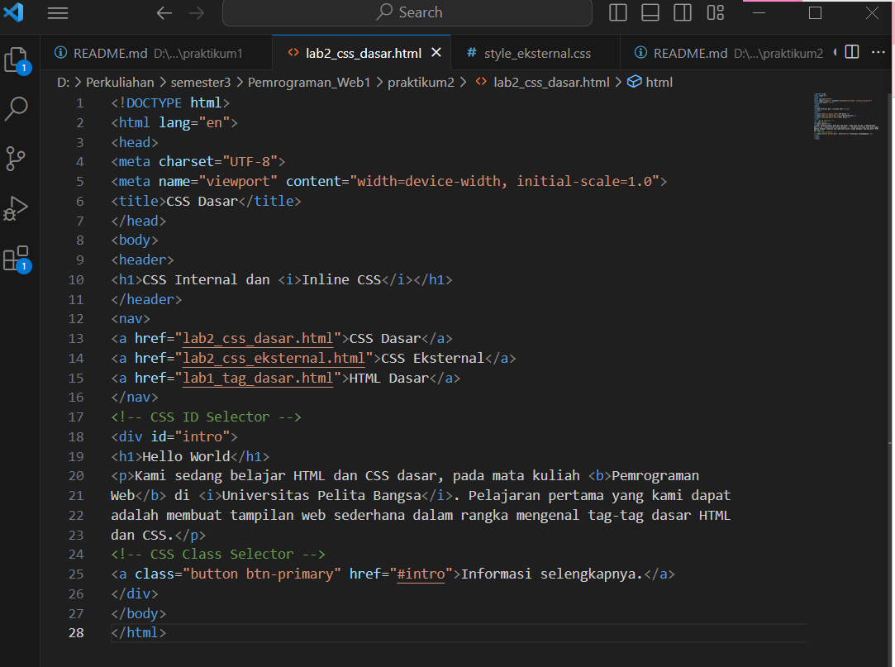
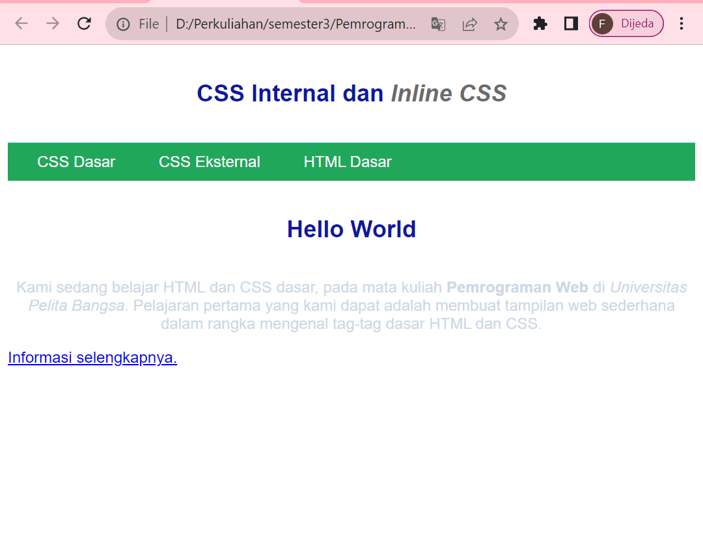

# CSS Dasar
## Langkah-langkah Praktikum
### 1. Membuat dokumen HTML
Buatlah dokumen HTML seperti berikut :
```html
<!DOCTYPE html>
<html lang="en">
<head>
<meta charset="UTF-8">
<meta name="viewport" content="width=device-width, initial-scale=1.0">
<title>CSS Dasar</title>
</head>
<body>
<header>
<h1>CSS Internal dan <i>Inline CSS</i></h1>
</header>
<nav>
<a href="lab2_css_dasar.html">CSS Dasar</a>
<a href="lab2_css_eksternal.html">CSS Eksternal</a>
<a href="lab1_tag_dasar.html">HTML Dasar</a>
</nav>
<!-- CSS ID Selector -->
<div id="intro">
<h1>Hello World</h1>
<p>Kami sedang belajar HTML dan CSS dasar, pada mata kuliah <b>Pemrograman
Web</b> di <i>Universitas Pelita Bangsa</i>. Pelajaran pertama yang kami dapat
adalah membuat tampilan web sederhana dalam rangka mengenal tag-tag dasar HTML
dan CSS.</p>
<!-- CSS Class Selector -->
<a class="button btn-primary" href="#intro">Informasi selengkapnya.</a>
</div>
</body>
</html>
```




Selanjutnya buka pada brwoser untuk melihat hasilnya.


### 2. Mendeklarasikan CSS Internal
Kemudian tambahkan deklarasi CSS internal seperti berikut pada bagian head dokumen.
```html
<head>
<title>CSS Dasar</title>
<style>
body {
font-family:'Open Sans', sans-serif;
}
header {
min-height: 80px;
border-bottom:1px solid #77CCEF;
}
h1 {
font-size: 24px;
color: #0F189F;
text-align: center;
padding: 20px 10px;
}
h1 i {
color:#6d6a6b;
}
</style>
</head>
```


Selanjutnya simpan perubahan yang ada, dan lakukan refresh pada browser untuk melihat
hasilnya.


### 3. Menambahkan Inline CSS
Kemudian tambahkan deklarasi inline CSS pada tag <p> seperti berikut.

```html
<p style="text-align: center; color: #ccd8e4;">
```


Simpan kembali dan refresh kembali browser untuk melihat perubahannya.


### 4. Membuat CSS Eksternal
Buatlah file baru dengan nama style_eksternal.css kemudian buatlah deklarasi CSS seperti berikut.

```css
nav {
background: #20A759;
color:#fff;
padding: 10px;
}
nav a {
color: #fff;
text-decoration: none;
padding:10px 20px;
}
nav .active,
nav a:hover {
background: #0B6B3A;
}
```


Kemudian tambahkan tag (link) untuk merujuk file css yang sudah dibuat pada bagian (head).

```html
<head>
<!-- menyisipkan css eksternal -->
<link rel="stylesheet" href="style_eksternal.css" type="text/css">
</head>
```


Selanjutnya refresh kembali browser untuk melihat perubahannya.




### 5. Menambahkan CSS Selector
Selanjutnya menambahkan CSS Selector menggunakan ID dan Class Selector. Pada file
style_eksternal.css, tambahkan kode berikut.

```CSS
/* ID Selector */
#intro {
background: #418fb1;
border: 1px solid #099249;
min-height: 100px;
padding: 10px;
}
#intro h1 {
text-align: left;
border: 0;
color: #fff;
}
/* Class Selector */
.button {
padding: 15px 20px;
background: #bebcbd;
color: #fff;
display: inline-block;
margin: 10px;
text-decoration: none;
}
.btn-primary {
background: #E42A42;
}
```


Kemudian simpan kembali dan refresh browser untuk melihat perubahannya.


## Pertanyaan dan Tugas
1. Lakukan eksperimen dengan mengubah dan menambah properti dan nilai pada kode CSS
dengan mengacu pada CSS Cheat Sheet yang diberikan pada file terpisah dari modul ini.

di sini saya melakukan perubahan pada body :

```CSS
body {
background: linear-gradient(0deg, #2bebdb 0%, #007506 50%, #070a91 100%);
overflow:hidden;
width: 100wh;
height: 100vh;
}
```


hasilnya :


2. Apa perbedaan pendeklarasian CSS elemen h1 {...} dengan #intro h1 {...}? berikan
penjelasannya!

jawaban

perbedaaannya jika hanya h1{} maka akan merubah semua yang ada didalam elemen h1 sedangkan intro h1 hanya akan merubah yang memiliki tag intro

3. Apabila ada deklarasi CSS secara internal, lalu ditambahkan CSS eksternal dan elemen yang sama. Deklarasi manakah yang akan ditampilkan pada browser? Berikan
penjelasan dan contohnya!

jawaban

jika ketiga CSS merubah elemen yang sama maka deklarasi tersebut akan mengikuti aturan prioritas dimana prioritas CSS nya seperti ini:

inline CSS
ID selector CSS
internal CSS
external CSS contoh: ini adalah tampilan coding pada html testing dimana terdapat 2 kalimat yang memiliki elemen yang sama yaitu h1:

disini bisa dilihat sudah terdapat 2 css mencoba merubah warna text h1 :


dan hasil adalah :


4. Pada sebuah elemen HTML terdapat ID dan Class, apabila masing-masing selector tersebut terdapat deklarasi CSS, maka deklarasi manakah yang akan ditampilkan pada browser?
Berikan penjelasan dan contohnya! ( p id="paragraf-1" class="text-paragraf" )


jawab :


## sekian :)

FERIYANI NURHIDA

TI.22.A2

312210222